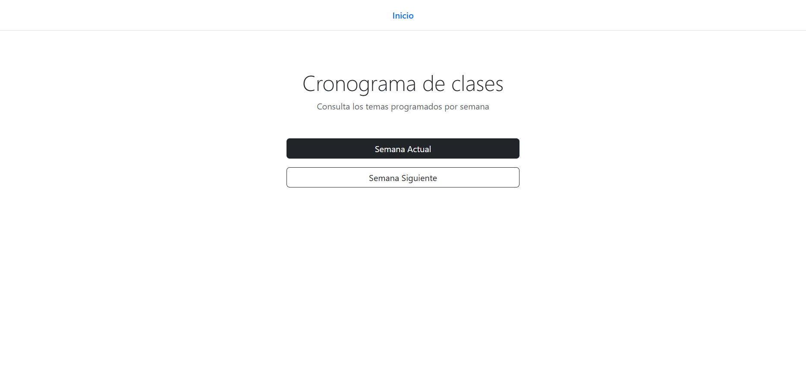
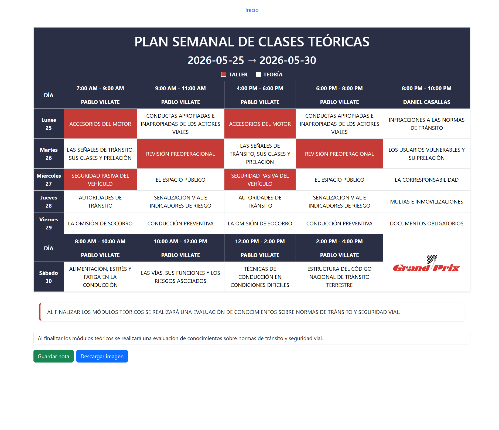

# 📆 Creación de Cronograma Semanal

Sistema para la generación y consulta de cronogramas académicos semanales.

A partir de una lista de temas (`topics`), el sistema genera automáticamente el cronograma de la **semana actual** y de la **semana siguiente**, asignando los temas según su tipo (teoría o taller) y la configuración establecida.

---

# 🗄️ Base de Datos

**Motor:** SQLite

## Modelos

```sql
CREATE TABLE topics (
    id INTEGER PRIMARY KEY AUTOINCREMENT,
    name TEXT NOT NULL,
    type TEXT NOT NULL -- theory | workshop
);

CREATE TABLE settings (
    key TEXT PRIMARY KEY,
    value TEXT NOT NULL
);

CREATE TABLE instructors (
    id INTEGER PRIMARY KEY AUTOINCREMENT,
    name TEXT NOT NULL
);

CREATE TABLE time_slots (
    id INTEGER PRIMARY KEY AUTOINCREMENT,
    label TEXT NOT NULL,
    block_type TEXT NOT NULL -- weekday | saturday
);

CREATE TABLE weeks (
    id INTEGER PRIMARY KEY AUTOINCREMENT,
    week_start DATE NOT NULL,
    week_end DATE NOT NULL
);

CREATE TABLE week_days (
    id INTEGER PRIMARY KEY AUTOINCREMENT,
    week_id INTEGER NOT NULL,
    date DATE NOT NULL,
    day_name TEXT NOT NULL,
    day_number INTEGER NOT NULL,
    is_holiday INTEGER DEFAULT 0,
    FOREIGN KEY (week_id) REFERENCES weeks(id)
);

CREATE TABLE week_time_slot_instructors (
    id INTEGER PRIMARY KEY AUTOINCREMENT,
    week_id INTEGER NOT NULL,
    time_slot_id INTEGER NOT NULL,
    instructor_id INTEGER NOT NULL,
    FOREIGN KEY (week_id) REFERENCES weeks(id),
    FOREIGN KEY (time_slot_id) REFERENCES time_slots(id),
    FOREIGN KEY (instructor_id) REFERENCES instructors(id)
);

CREATE TABLE classes (
    id INTEGER PRIMARY KEY AUTOINCREMENT,
    week_day_id INTEGER NOT NULL,
    topic_id INTEGER NOT NULL,
    FOREIGN KEY (week_day_id) REFERENCES week_days(id),
    FOREIGN KEY (topic_id) REFERENCES topics(id)
);

CREATE TABLE notes (
    id INTEGER PRIMARY KEY AUTOINCREMENT,
    text TEXT NOT NULL
);
```

---

# ⚙️ Configuración Inicial

## Base de datos

Antes de generar cronogramas, la base de datos debe contener información básica.

### 1. Temas

Registrar los temas disponibles en la tabla `topics`.

Ejemplo:

| id  | name                       | type     |
| --- | -------------------------- | -------- |
| 1   | Variables y tipos de datos | theory   |
| 2   | Ejercicios de variables    | workshop |

---

### 2. Instructores

Registrar los instructores en la tabla `instructors`.

Ejemplo:

| id  | name        |
| --- | ----------- |
| 1   | Juan Pérez  |
| 2   | María Gómez |

---

### 3. Bloques Horarios

Registrar los bloques horarios en la tabla `time_slots`.

Ejemplo:

| id  | label         | block_type |
| --- | ------------- | ---------- |
| 1   | 07:00 - 08:30 | week_day   |
| 2   | 08:30 - 10:00 | week_day   |
| 3   | 07:00 - 09:00 | saturday   |

---

### 4. Configuración del índice de temas

La tabla `settings` debe contener los índices utilizados para determinar cuál será el próximo tema asignado al cronograma.

```sql
INSERT INTO settings (key, value)
VALUES
('current_theory_topic_index', '1'),
('current_workshop_topic_index', '1');
```

Estos valores son actualizados automáticamente por el sistema a medida que se generan nuevas semanas.

---

Puedes redactarlo de forma más técnica y clara:

## Asignación de Instructores

Al generar una nueva semana, el sistema crea automáticamente los registros de asignación de instructores para cada franja horaria en la tabla `week_time_slot_instructors`.

La distribución inicial se basa en la constante:

```python
DEFAULT_WEEK_TIME_SLOT_INSTRUCTORS
```

ubicada en:

```text
app/core/constants.py
```

Esta configuración define qué instructor será asignado por defecto a cada bloque horario. Posteriormente, las asignaciones pueden ser modificadas desde la interfaz web sin afectar la configuración predeterminada.

---

# 🛠️ Funcionalidades

## Consulta de Cronogramas

El sistema permite visualizar el cronograma correspondiente a la semana actual y a la semana siguiente.

## Edición de Instructores

Es posible modificar el instructor asignado a cualquier franja horaria del cronograma.

Para realizar el cambio:

1. Hacer clic sobre el nombre del instructor.
2. Seleccionar el nuevo instructor en la lista desplegable.
3. El cambio se guarda automáticamente en la base de datos.

## Edición de Temas

También es posible modificar el tema asignado a una clase específica.

Para realizar el cambio:

1. Hacer clic sobre el nombre del tema.
2. Seleccionar el nuevo tema en la lista desplegable.
3. El cambio se guarda automáticamente en la base de datos.

Todas las modificaciones realizadas desde la interfaz se reflejan de forma inmediata en el cronograma y quedan persistidas en la base de datos.

---

# Interfaces

### Inicio



### Cronograma semanal



---

# Captura de Pantalla (Puppeteer)

El sistema utiliza **Puppeteer** para generar capturas de pantalla del cronograma.

## Instalación de dependencias

Antes de utilizar esta funcionalidad, es necesario instalar las dependencias definidas en el archivo `package.json`:

```bash
npm install
```

Este comando descargará e instalará Puppeteer y las demás dependencias requeridas por el proyecto.

## Directorio de capturas

También es necesario crear manualmente el siguiente directorio:

```text
app/
└── static/
    └── screenshots/
```

Las imágenes generadas por Puppeteer se almacenarán en esta carpeta.

---

# 🚀 Ejecución

## 1. Crear un entorno virtual

Windows:

```bash
python -m venv .venv
```

## 2. Activar el entorno virtual

```bash
.venv\Scripts\Activate.ps1 # Windows (PowerShell):
.venv\Scripts\activate.bat # Windows (CMD):
source .venv/bin/activate # Linux / macOS:
```

## 3. Instalar dependencias

```bash
pip install -r requirements.txt
```

## 4. Ejecutar la aplicación

```bash
python run.py
```

Por defecto, la aplicación se ejecuta con el modo debug habilitado para facilitar el desarrollo.

Si deseas utilizar la aplicación en un entorno diferente, puedes modificar esta configuración en el archivo run.py.
